# ✈️ Flight Booking System – Java Servlets & JSP (MVC Architecture)

Sebuah aplikasi **Flight Booking System berbasis web** yang **responsif** dan dibangun menggunakan **Java Servlets** dan **Java Server Pages (JSP)** dengan arsitektur **Model-View-Controller (MVC)**.  

---

## 🧰 Teknologi yang Digunakan

### **Frontend**
- HTML  
- CSS  
- JavaScript  
- jQuery  
- Bootstrap  
- JSP (Java Server Pages)  
- AJAX (untuk widget pencarian penerbangan)

### **Backend**
- Java Servlets  
- Java Models  
- Database: Microsoft Access  

### **Web Service**
- SOAP Web Services  
  - Mendapatkan harga dan jumlah kursi yang tersedia

---

## 👥 Role Pengguna

Aplikasi ini memiliki tiga jenis peran:

- **Airline Admin**
- **Airline Manager**
- **Customer**

---

## 🔄 Alur Kerja Aplikasi (Workflow)

Aplikasi ini dirancang untuk digunakan oleh satu maskapai penerbangan yang ingin menjual kursi secara online. Berikut alur kerjanya:

1. **Airline Admin** menetapkan harga untuk tiga jenis kursi:
   - First Class  
   - Business  
   - Economy  
2. Admin dapat membuat dan memperbarui fitur untuk setiap jenis kursi.  
3. Admin menentukan jumlah kursi yang tersedia untuk setiap penerbangan.  
4. **Airline Manager** akan melihat daftar kursi yang baru ditambahkan/diperbarui oleh Admin saat login.  
5. Manager harus menyetujui harga atau perubahan tersebut.  
6. Hanya setelah disetujui Manager, perubahan akan muncul dan dapat dibeli oleh Customer.  
7. **Customer** dapat membeli kursi sesuai ketersediaan.  
8. Sistem otomatis menghitung kursi tersisa — jika kursi habis, Customer tidak dapat membeli lagi.  
9. Customer dapat memilih kursi berdasarkan:
   - Kota asal & tujuan  
   - Tanggal perjalanan  
   - Jumlah penumpang  
10. Setelah memilih kursi, Customer melihat **itinerary** pemesanan.  
11. Setelah disetujui, Customer diarahkan ke halaman pembayaran dengan total harga.  
12. Setelah pembayaran dianggap sukses, kursi ditandai sebagai terjual.  
13. Sistem mengirimkan **email itinerary** kepada Customer.

---

## 📸 Tampilan Antarmuka (Screenshots)

#### Home Pages
<p align="middle">
   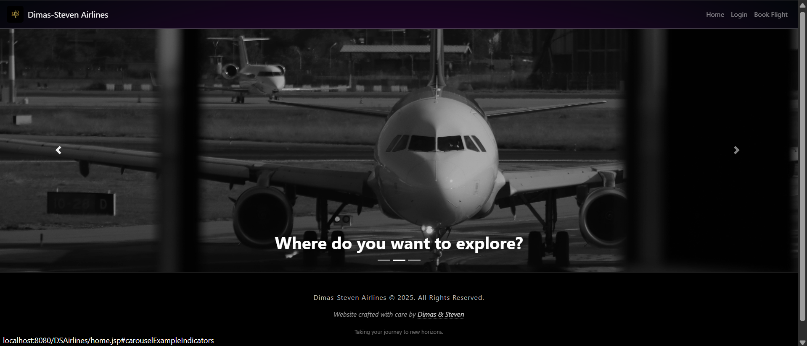
   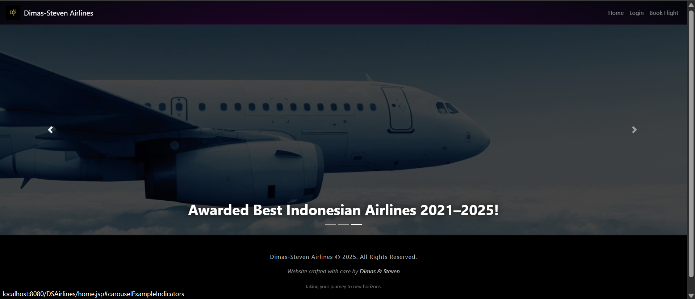
   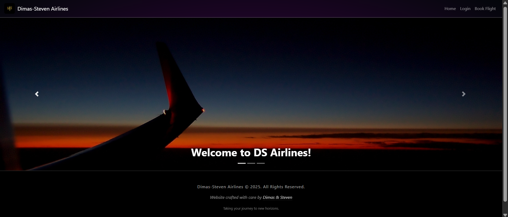
</p>

#### Login Page and Book Flight
<p align="middle">
   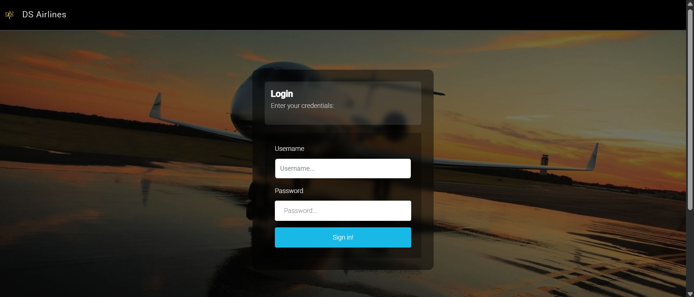
   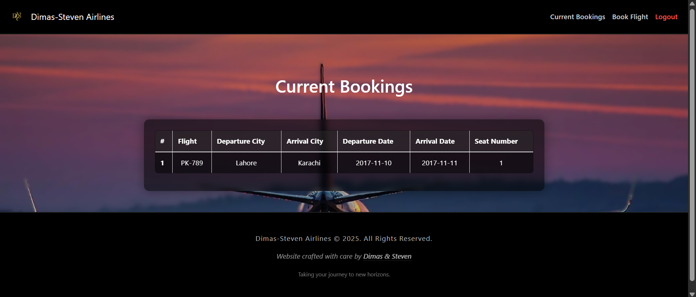

</p>

#### Current Bookings and Itinerary
<p align="middle">
   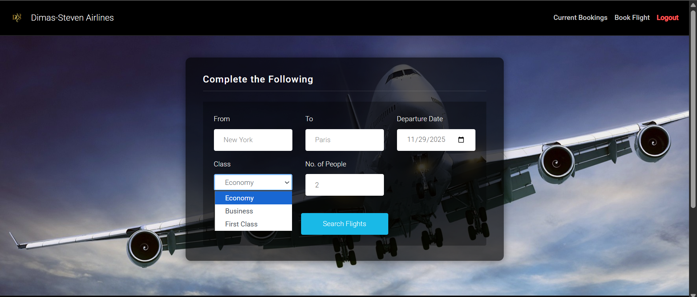
   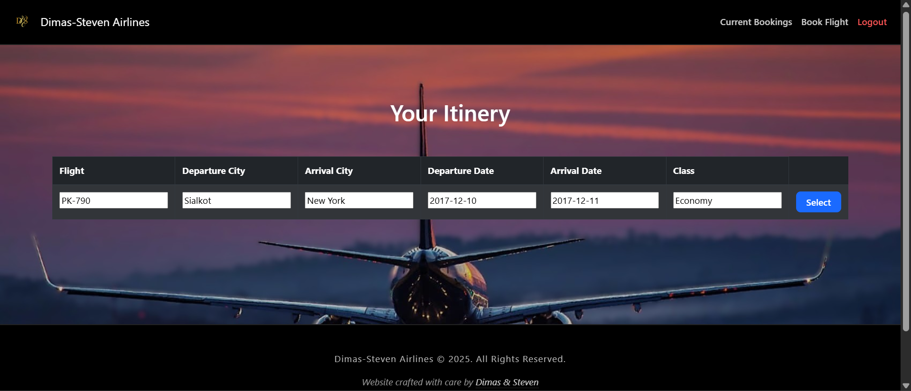
   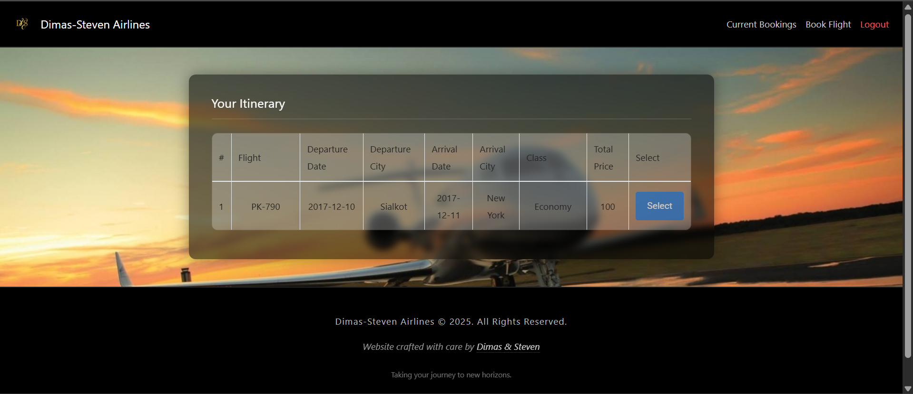
   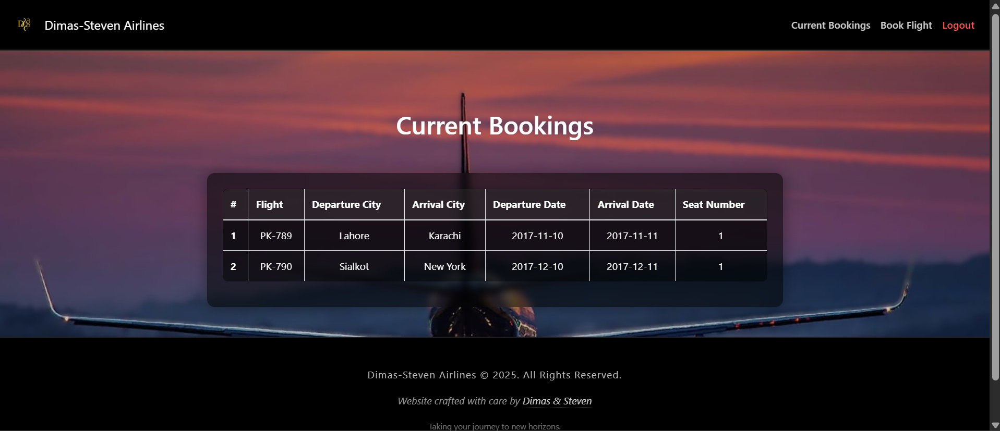  
</p>

#### Seat Features and Seats as Admin
<p align="middle">
   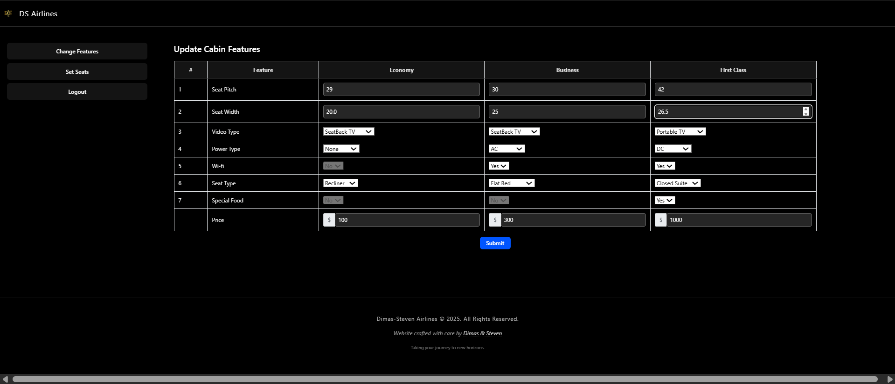
   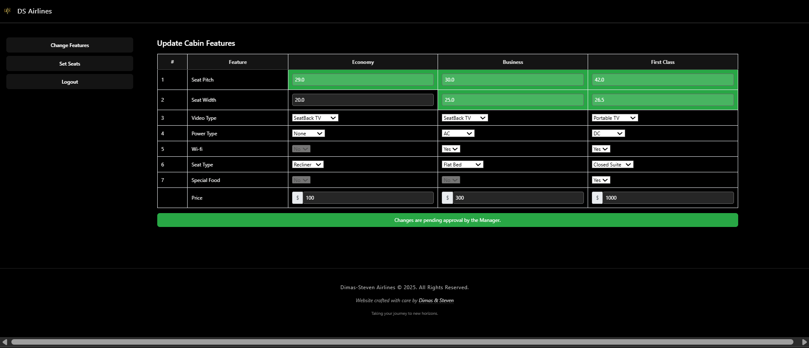
   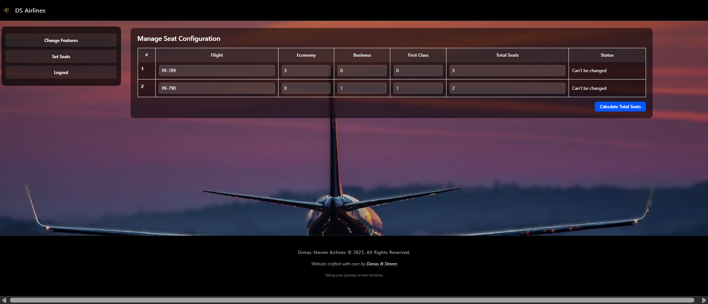
   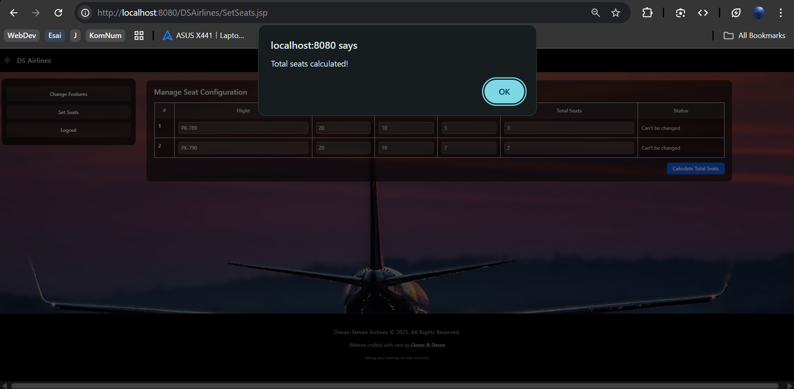
   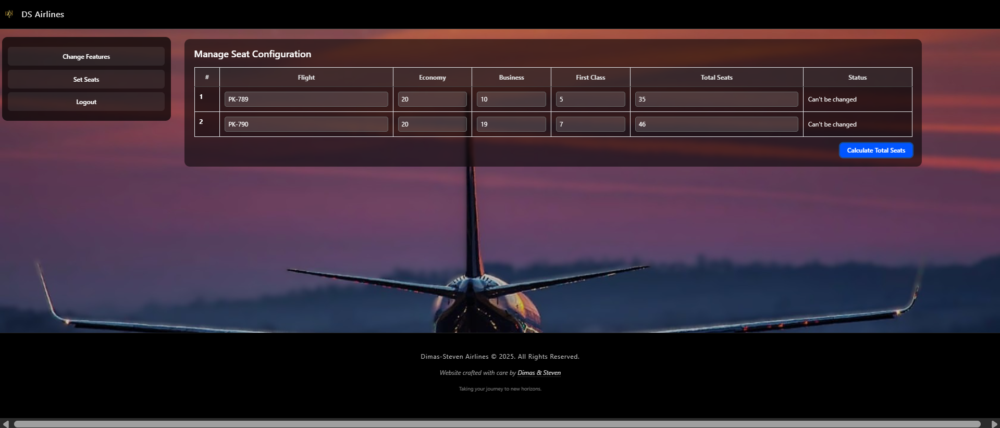
</p>

#### Approval New Features and Seats as Manager
<p align="middle">
   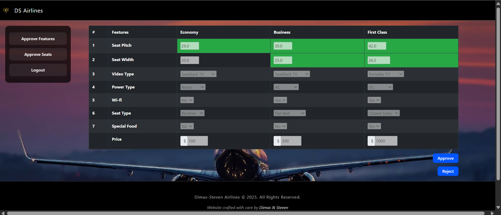
   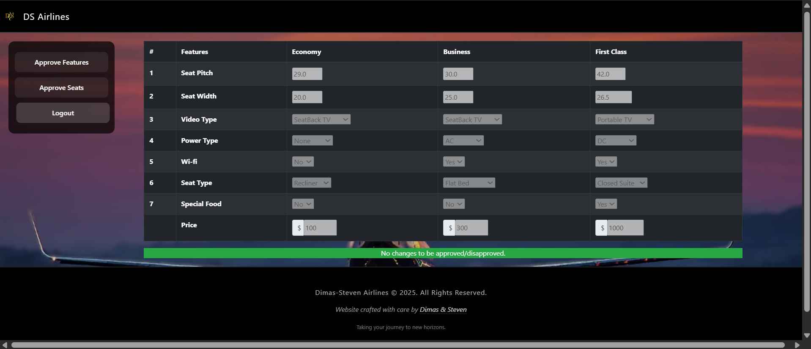
</p>


## 🚀 Cara Menjalankan Project

### 1. Install Tools yang Dibutuhkan

Pastikan kamu sudah menginstall:

- **Java SE Development Kit 8 (JDK 8)**  
   Download: http://www.oracle.com/technetwork/java/javase/downloads/jdk8-downloads-2133151.html

- **NetBeans IDE** (versi dengan Apache Tomcat di dalamnya – wajib!)  
   Download: https://netbeans.org/downloads/

### 2. Konfigurasi Apache Tomcat (Roles & Users)

1. Buka **NetBeans IDE**
2. Masuk ke: **Services → Servers → Apache Tomcat**
3. Klik kanan **Apache Tomcat → Properties**
4. Copy nilai **Catalina Base Path**, lalu buka folder tersebut
5. Buka folder **conf → tomcat-users.xml**
6. Tambahkan konfigurasi role dan user berikut sebelum tag penutup `</tomcat-users>`:

```xml
<role rolename="Manager"/>
<role rolename="Admin"/>
<role rolename="Customer"/>

<user username="dimas@admin.com" password="a" roles="Admin"/>
<user username="steven@manager.com" password="m" roles="Manager"/>
<user username="shariq@customer.com" password="c" roles="Customer"/>
```

> **Catatan:** Hanya user yang terdaftar di file ini yang bisa login ke sistem DSAirlines. Gunakan credential di atas untuk mengakses aplikasi sesuai role-nya.

### 3. Menjalankan Project

1. Restart **NetBeans**
2. Klik **File → Open Project**
3. Arahkan ke folder project kamu: `Project/DSAirlines`
4. Pilih project **DSAirlines**, lalu klik **Open Project**
5. Pastikan server **Tomcat** sudah berjalan
6. Klik **Run Project** untuk menjalankan aplikasi

---

